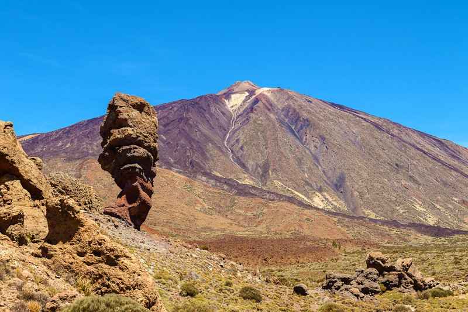

# 📍 Canary Trails

__Autores: Melissa Ruiz González y Pedro Martín Escuela__

<div align=center>
    
</div>

<br>

En este repositorio realizaremos nuestro __Proyecto Final__ del __CFGS de Desarrollo de Aplicaciones Multiplataforma__. 

El __objetivo__ de este proyecto es la __creación__ de una __aplicación móvil__ para __descubrir rutas de senderismo__ en __Canarias__, con __información detallada__ de los __senderos y la flora__ presente en cada zona. 

## 🚀 Tecnologías
- **Frontend:** React Native  
- **Backend:** Java  
- **Base de datos:** MySQL y MongoDB 

## 🔥 Características
- Explora rutas de senderismo en Canarias con mapas interactivos.
- Consulta información sobre la flora en cada sendero.
- Guarda y comparte rutas favoritas.
- Sistema de geolocalización y recomendaciones.

## 📌 Instalación (inicial)

### Requisitos
- Node.js y npm
- JDK 17+
- React Native CLI o Expo

### Clonar el repositorio

```bash
    git clone https://github.com/mruizgl/canary-trails/
    cd canary-trails
```

## Índice 

- [Manual del Usuario](#manual)

- [Documentacion del Diseño](#docudis)

    - [Diagramas](#diagrams)

    - [Wireframe](#wireframe)

- [Documentacion del Codigo](#docucode)

    - [Api REST](#api)

    - [App React Native](#app)

    - [Sistema de Gestion Administrador](#gestion)

- [Despliegue](#despliegue)

- [Manual de Uso y Configuracion](#manual)


