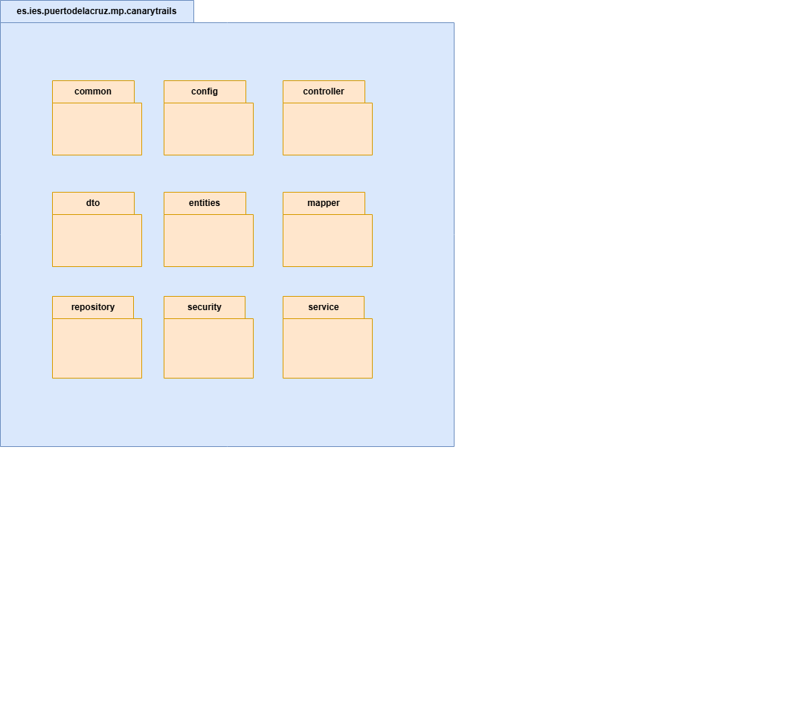
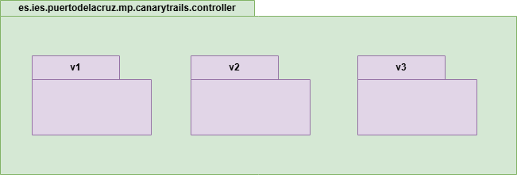
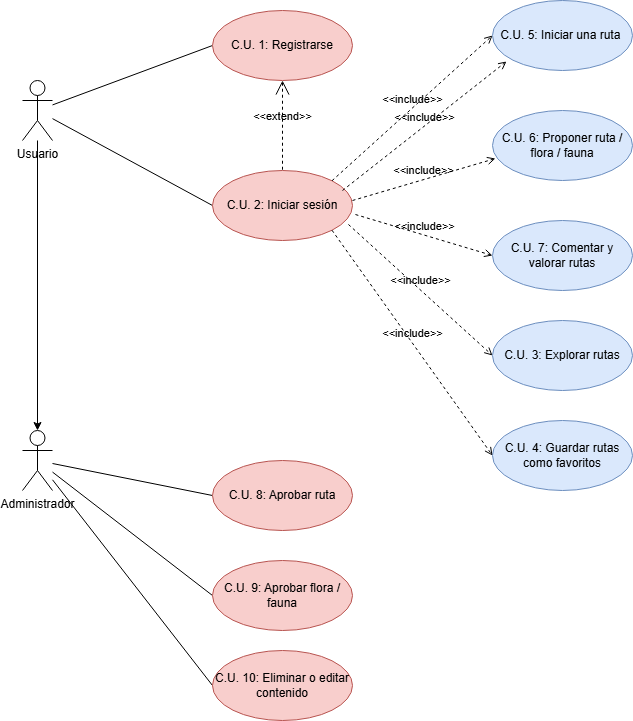
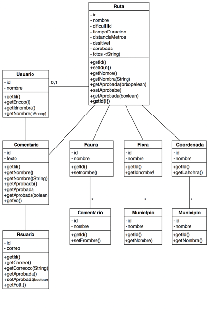
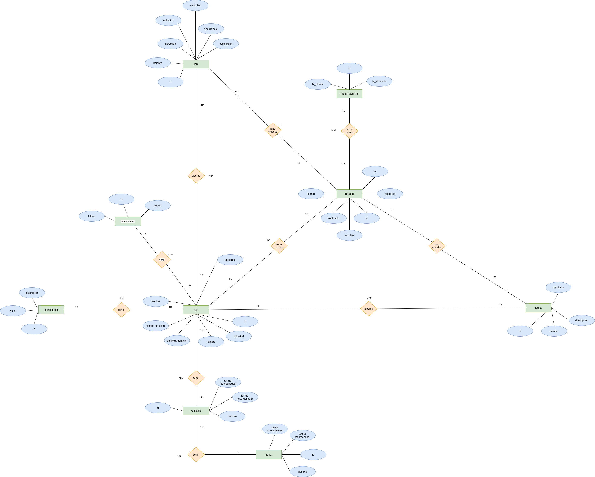

# Anteproyecto – CanaryTrails

**Autores:** Melissa Ruiz, Pedro Martín Escuela  
**Centro:** I.E.S. Puerto de la Cruz – Telesforo Bravo  
**Módulo:** Proyecto (CFGS DAM)  
**Tutor:** Eleazar Morales Díaz / David Betancor Quijada  

---

## Introducción

Este documento recoge el planteamiento y diseño inicial del proyecto **CanaryTrails**, una aplicación multiplataforma para la planificación, exploración y disfrute de rutas de senderismo en las Islas Canarias. Incluye funcionalidades relacionadas con fauna y flora, navegación GPS, y opciones offline.

---

## Objetivo general del proyecto

Diseñar y desarrollar una **aplicación móvil** especializada en rutas de senderismo por Canarias, integrando información sobre **flora y fauna autóctona** y fomentando el turismo local mediante funcionalidades interactivas y educativas.

---

## Diagramas
### Diagrama de paquetes 

 

## Casos de Uso  
# 📌 Diagrama de Casos de Uso – CanaryTrails

### Índice

- [Especificación](#especificacion)
- [Actores](#actores)
- [Casos de uso](#casos-de-uso)
- [Diagrama de casos de uso](#diagrama-de-casos-de-uso)

---

## Especificación

### Especificación de Actores

| Actor     | Usuario común                                                 |
|-----------|----------------------------------------------------------------|
| Descripción | Persona que explora rutas, comenta y guarda favoritas         |
| Características | Rol básico de uso sin privilegios administrativos         |
| Relajaciones | No puede validar contenido ni gestionar usuarios             |
| Referencias | C.U.1 – C.U.7                                                 |
| Notas      |                                                               |
| Autores      | Melissa Ruiz, Pedro Martín                                   |
| Fecha      | 20/05/2025                                                         |

| Atributo            | Descripción                        | Tipo     |
|---------------------|------------------------------------|----------|
| `id`                | Identificador del usuario          | int      |
| `nombre`            | Nombre completo del usuario        | String   |
| `correo`            | Correo electrónico único           | String   |
| `rol`               | Rol del usuario (`USER`)           | String   |

| Actor     | Administrador                                                  |
|-----------|----------------------------------------------------------------|
| Descripción | Usuario con privilegios para aprobar rutas, flora y fauna     |
| Características | Acceso completo al panel de gestión                       |
| Relajaciones | Solo accede a funcionalidades administrativas                |
| Referencias | C.U.8 – C.U.10                                                |
| Notas      |                                                               |
| Autores      | Melissa Ruiz, Pedro Martín                                   |
| Fecha      | 20/05/2025                                                         |

| Atributo            | Descripción                        | Tipo     |
|---------------------|------------------------------------|----------|
| `id`                | Identificador del admin            | int      |
| `nombre`            | Nombre del administrador           | String   |
| `rol`               | Rol (`ADMIN`)                      | String   |

---

## Casos de uso <a name="casos-de-uso"></a>

### C.U.1 – Registrarse  
**Actor:** Usuario  
**Descripción:** El usuario se registra proporcionando sus datos.  
**Requisitos:** No estar previamente registrado.  
**Postcondición:** Usuario creado, en espera de verificación.

---

### C.U.2 – Iniciar sesión  
**Actor:** Usuario  
**Descripción:** El usuario accede con correo y contraseña.  
**Requisitos:** Debe estar registrado y verificado.  
**Postcondición:** Token generado para acceso.

---

### C.U.3 – Explorar rutas  
**Actor:** Usuario  
**Descripción:** Filtra y visualiza rutas según ubicación, dificultad y duración.  
**Postcondición:** Se muestran rutas que coinciden.

---

### C.U.4 – Guardar ruta como favorita  
**Actor:** Usuario  
**Descripción:** Guarda una ruta en su lista personal de favoritas.  
**Postcondición:** Relación usuario-ruta guardada en BBDD.

---

### C.U.5 – Iniciar una ruta GPS  
**Actor:** Usuario  
**Descripción:** Activa navegación GPS y seguimiento de coordenadas.  
**Precondición:** Ruta descargada (modo offline o no).  
**Postcondición:** Se registran puntos de paso.

---

### C.U.6 – Proponer una ruta / flora / fauna  
**Actor:** Usuario  
**Descripción:** Envía nueva entrada que queda pendiente de aprobación.  
**Postcondición:** Entrada almacenada con estado `aprobada=false`.

---

### C.U.7 – Comentar y valorar rutas  
**Actor:** Usuario  
**Descripción:** Escribe comentarios o puntuaciones en una ruta concreta.  
**Postcondición:** Comentario visible en la ficha de ruta.

---

### C.U.8 – Aprobar rutas  
**Actor:** Administrador  
**Descripción:** Valida o rechaza rutas propuestas por los usuarios.  
**Precondición:** Ruta pendiente de aprobación.  
**Postcondición:** Estado `aprobada=true`.

---

### C.U.9 – Aprobar flora / fauna  
**Actor:** Administrador  
**Descripción:** Gestiona especies propuestas por la comunidad.  
**Postcondición:** Quedan visibles al resto de usuarios.

---

### C.U.10 – Eliminar o editar contenido  
**Actor:** Administrador  
**Descripción:** Puede borrar rutas o editar datos incorrectos.  
**Postcondición:** Cambios reflejados en la base de datos.

---

## Diagrama de casos de uso <a name="diagrama-de-casos-de-uso"></a>

```
[Usuario] --> (Registrarse)
[Usuario] --> (Iniciar sesión)
[Usuario] --> (Explorar rutas)
[Usuario] --> (Guardar ruta como favorita)
[Usuario] --> (Iniciar una ruta GPS)
[Usuario] --> (Proponer una ruta / flora / fauna)
[Usuario] --> (Comentar y valorar rutas)

[Administrador] --> (Aprobar rutas)
[Administrador] --> (Aprobar flora / fauna)
[Administrador] --> (Eliminar o editar contenido)
```

 

## Diarama de clases  
 

## Diarama de Entidad Relacion  
 

## Descripción del proyecto (alcance)

CanaryTrails permitirá:
- Buscar rutas filtradas por dificultad, duración y ubicación.
- Ver mapas, imágenes y especies asociadas a cada ruta.
- Iniciar rutas con GPS y usar la app sin conexión.
- Guardar favoritas, comentar, valorar y proponer contenido.
- Jugar mediante el avistamiento de especies (gamificación educativa).

---

## Roles de usuario

- **Usuario común:** puede usar todas las funciones salvo validación.
- **Administrador:** gestiona rutas, usuarios y contenido propuesto.

---

## Arquitectura y estructura

- **Frontend móvil:** React Native + TypeScript, navegación modular, estilo natural minimalista.
- **Backend:** Java 17 con Spring Boot, REST API segura con JWT, Swagger, testing con JUnit.
- **Base de datos:** MySQL relacional, modelado con claves foráneas, control de integridad.
- **CI/CD:** Azure DevOps o GitHub Actions.

---

## Funcionalidades específicas

- Registro/Login seguro con JWT.
- Exploración avanzada con filtros.
- Guardar rutas favoritas.
- Uso en modo offline.
- Subida de rutas y especies con aprobación administrativa.
- Comentarios y valoraciones.
- Gamificación tipo "avistamiento Pokémon".
- Navegación GPS y multilingüe (ES/EN).

---

## Tecnología principal

- **Frontend:** React Native, React Navigation, AsyncStorage, i18next.
- **Backend:** Java 17, Spring Boot, Spring Security, JWT, Swagger.
- **BBDD:** MySQL.
- **APIs externas:** Mapbox / Google Maps, OpenWeather, geolocalización.

---

## Tareas y planificación

(Ver tabla de tareas detallada en el documento PDF original)

---

## Recursos Humanos y Materiales

- Melissa: Diseño UI/UX, testin, integración, documentación.
- Pedro: Backend, base de datos, seguridad, integración, desarrollo móvil
- Herramientas: Figma, IntelliJ, VS Code, Docker, GitHub, Postman, emuladores.

---

## Seguimiento y control de calidad

- Uso de GitHub Projects + Issues + Milestones.
- Reuniones de seguimiento cada 2-3 días.
- Pruebas unitarias con JUnit y Mockito.
- Validación en dispositivos reales y emuladores.

---

## Wireframes y diseño

Diseño en Figma con enfoque natural, accesible y minimalista.  
Colores base: verde (#57E389), naranja (#F47A3D), gris (#41463D), lila (#9D8DF1), azul (#B8CDF8).

---

## Plan de Marketing

- **Buyer Persona:** Laura, 32 años, senderista en Tenerife.
- **Competencia:** Wikiloc, AllTrails – sin foco local ni educativo.
- **Tendencias:** apps outdoor, turismo sostenible, gamificación.
- **Estrategia:** redes sociales, SEO, colaboraciones locales.
- **Modelo de negocio:** freemium con suscripciones y experiencias premium.

---

## Plan de Sostenibilidad

- **Económica:** bajos costes, hosting eficiente.
- **Social:** accesibilidad, educación ambiental.
- **Ambiental:** app optimizada, sin papel, mensajes eco.

---

**Repositorio GitHub:** [https://github.com/mruizgl/canary-trails](https://github.com/mruizgl/canary-trails)
