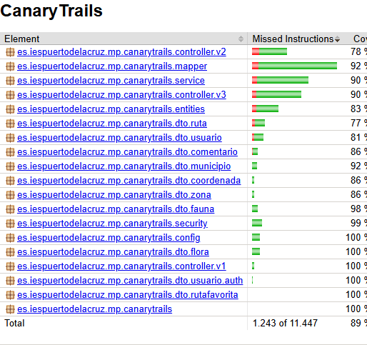

---
## API REST – Backend (Spring Boot)

**Lenguaje:** Java 17  
**Framework:** Spring Boot  
**Seguridad:** JWT  
**Base de datos:** MySQL  
**ORM:** Spring Data JPA  
**Documentación:** Swagger

### Paquetes principales
- `controller`: Controladores REST.
- `entities`: Entidades JPA del modelo de datos.
- `dto`: Data Transfer Objects para entrada/salida.
- `repository`: Interfaces para acceso a la base de datos.
- `service`: Lógica de negocio (implementa `IServiceGeneric`).
- `mapper`: Conversores entre entidades y DTOs (MapStruct).
- `security`: Configuración de autenticación/autorización con JWT.

### Seguridad
- Autenticación con token JWT.
- Control de acceso por rol (`ROLE_ADMIN`, `ROLE_USER`).
- Filtros personalizados (`JwtFilter`, `SecurityConfig`).
- Verificación de cuentas por correo (`Mail Sender`).

### Testing
- JUnit 5 y Mockito para tests de:
  - Repositorios.
  - Servicios.
  - Controladores.
  - Mappers.  

Cuenta con una cobertura de código del 89% generada por JaCoCo  
  


---

## App Móvil – React Native

**Lenguaje:** JavaScript / TypeScript  
**Framework:** React Native  
**Librerías clave:**
- `react-navigation` → Navegación por pantallas.
- `axios` → Llamadas a la API.
- `react-native-maps` → Visualización de rutas.
- `expo-file-system` y `async-storage` → Modo offline.

### 📲 Pantallas principales
- Registro / Login
- Explorar rutas
- Información de ruta
- Buscar ruta
- Traking en tiempo real (configurable)
- Crear ruta / fauna / flora
- Flora / Fauna asociada
- Informacion Perfil
- Rutas Favoritas
- Creaciones

---

## Pruebas y Calidad

- Cobertura de código con JaCoCo.
- Validación de DTOs con `javax.validation`.
- Tests para control de errores (`@ControllerAdvice`).
- CI/CD opcional con GitHub Actions (configurable).

---

## Despliegue 
En el futuro:
- **Backend:** Puede ser desplegado DigitalOcean.
- **App:** Compilar como APK para Android o IPA para iOS.
- **Admin:** Dolibarr puede instalarse en servidor web Apache o Nginx.

---

## Observaciones Técnicas

- Se exponen las fotos desde local a diferentes endpoints mediante un webconfig y `Resources Handler`
- Todas las relaciones están correctamente modeladas con claves foráneas y tablas intermedias.
- Controladores REST siguen convención RESTful: `GET`, `POST`, `PUT`, `DELETE`.

---

## Enlaces útiles

- [Manual de uso](./manual-de-uso.md)
- [Manual de usuario](./manual-de-usuario.md)
- [Diseño UI/UX](./documentacion-de-diseno.md)


---

## App Móvil – React Native

**Lenguaje:** JavaScript / TypeScript  
**Framework:** React Native  
**Gestor de paquetes:** npm  
**Ecosistema:** Android

---

### Estructura de Carpetas Principal  
```
AppCanaryTrails/
│
├── src/
│ ├── api/ → Configuración de Axios y peticiones a la API
│ ├── components/ → Componentes reutilizables (cards, botones, etc.)
│ ├── constants/ → Estilos globales, colores, iconos, traducciones
│ ├── navigation/ → Stack, tab y drawer navigators
│ ├── screens/ → Pantallas principales (Inicio, Ruta, Perfil, etc.)
│ ├── store/ → Gestión de estado (Redux, Context API u otra)
│ └── utils/ → Funciones auxiliares, validaciones, helpers
│
├── assets/ → Imágenes, iconos, fuentes
├── App.js → Punto de entrada de la app
├── .env → Variables de entorno
└── package.json
```

---

## Sistema Administrativo – Dolibarr

**Propósito:** Gestión de la empresa que comercializa la app.  
**Configuraciones básicas:**
- Gestión de clientes y proveedores.
- Productos/servicios (ej. planes premium o merchandising).
- Presupuestos, facturación y pedidos.
- Logotipo y diseño personalizado.

**Ruta recomendada de acceso:**  
`http://localhost/dolibarr/` o `/var/www/html/dolibarr/`