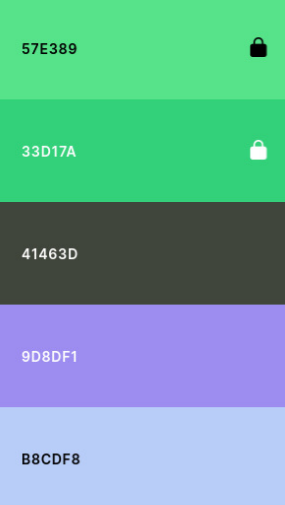

# Documentación de Diseño – CanaryTrails

Este documento recoge el proceso de diseño, decisiones visuales y principios de usabilidad aplicados en la creación de la aplicación *CanaryTrails*, tanto para la app móvil como para el panel web administrativo.

---

## 1. Enfoque de Diseño

La estética y experiencia de usuario de CanaryTrails se ha inspirado en tres pilares clave:

- Naturaleza: colores y formas que evocan el entorno canario.
- Funcionalidad: navegación simple y clara para usuarios de todas las edades.
- Multiplataforma: diseño adaptable para dispositivos móviles y tabletas.

---

## 2. Paleta de Colores

| Color     | Uso sugerido                        | Hex      |
|-----------|--------------------------------------|----------|
| Verde menta brillante   | Botones principales / elementos activos | `#57E389` |
| Verde bosque            | Íconos, botones secundarios             | `#33D17A` |
| Gris oscuro pizarra     | Texto, fondo de tarjetas o navbar       | `#41463D` |
| Lila claro               | Fondos suaves, UI decorativa            | `#9D8DF1` |
| Azul pastel              | Fondos secundarios o etiquetas          | `#B8CDF8` |

Esta combinación mantiene un equilibrio entre lo natural y lo moderno, alineándose con el espíritu de exploración y la identidad visual de la app.

---

## 3. Tipografía

- **Fuente principal**: `Poppins` (Google Fonts)
- **Pesos utilizados**:
  - `Regular` para textos.
  - `SemiBold` para botones y títulos.
  - `Bold` para encabezados y secciones destacadas.

---

## 4. Iconografía

Se utiliza una iconografía limpia basada en vectores (Material Icons / Lucide React), manteniendo coherencia en estilo y grosor. Los íconos ayudan a facilitar la navegación en:

- Menús.
- Favoritos.
- Ubicación GPS.
- Añadir rutas o especies.

---

## 5. Componentes de Interfaz

| Componente      | Descripción |
|------------------|-------------|
| **Navbar inferior** | Acceso rápido a rutas, favoritos, explorar y perfil. |
| **Mapa interactivo** | Visualiza el trazado de la ruta y tu posición GPS. |
| **Tarjetas de ruta** | Vista previa de rutas, con datos clave y botón de favorito. |
| **Ficha detallada** | Información completa sobre cada ruta: dificultad, duración, flora, fauna, mapa, comentarios. |
| **Vista de fauna/flora** | Muestra las especies asociadas a una ruta o buscables por categoría. |

---

## 6. Experiencia de Usuario (UX)

- Interacción intuitiva desde la primera pantalla.
- Adaptación para **modo offline** con notificación visual cuando no hay conexión.
- Multilingüe: español e inglés seleccionables desde configuración.
- Navegación real con GPS y estado de progreso visible.
- Facilidad para subir rutas con imágenes desde galería o cámara.

---

## 7. Accesibilidad

- Contraste alto entre texto y fondo.
- Tamaño de fuente legible en todos los dispositivos.
- Uso de etiquetas y roles para lectores de pantalla.
- Interfaz optimizada para navegación táctil.

---

## 8. Wireframes y Prototipos

Protipo de Figma
- Login y register en Figma

Wireframes
- Home   

  

- Profile 

- Routes and games 

Los wireframes contemplan:

- Pantalla de inicio / login.
- Explorador de rutas.
- Ficha de ruta.
- Mapa en tiempo real.
- Subida de rutas/fauna/flora.
- Perfil de usuario.

---

## 9. Adaptación a Marca

El diseño visual busca reforzar la identidad de marca:
- Nombre: *CanaryTrails*.
- Inspirado en paisajes volcánicos, verdes y rutas reales de las islas.
- Diseño visual coherente con turismo ecológico y exploración responsable.

---

## 10. Recomendaciones futuras

- Agregar modo oscuro.
- Personalización del perfil (foto, descripción).
- Sistema de logros o medallas por avistamientos o rutas completadas.

---
